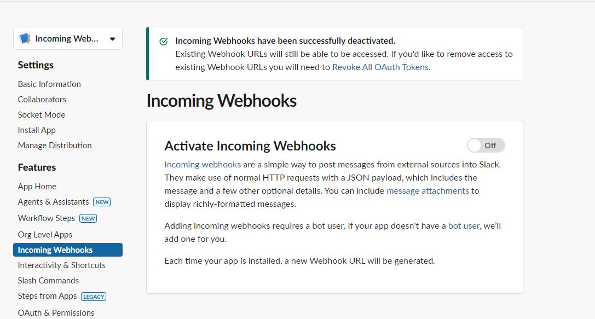

<h1>Serverless Application with AWS Lambda, DynamoDB, API Gateway, CloudFormation using Serverless Framework, Step Functions, Algolia, Go Pro Maps API and Slack Integration</h1>

Overview: 

This project demonstrates a serverless architecture using AWS Lambda, DynamoDB, API Gateway, CloudFormation using Serverless Framework, Step Functions, Go Pro Maps API, Algolia, and Slack for building a scalable and flexible event-driven application. Code uses NodeJS for development of project

 

Description: 

 

 This is store locator project similar to like dominos, atm finder or bank locator etc..

  

<li>Choose nodejs template from serverless </li>
<li>serverless create -t aws-nodejs </li>
<li>Edit serverless.yml file  </li>
<li>Add some libraries(dependencies) similar to java for dynamodb client i.e., aws-sdk </li>
<li>while loadash library is similar to collections, apache utils in java . this package providing handful of method present under lodash, Add lodash library</li>
<li> <a link = 'https://www.geeksforgeeks.org/lodash-collection-complete-reference/?ref=shm'> Lodash Complete Reference </a> 
</li>

<h3>
Create first lambda, Get All location data from DB - We just added dynamodb tbl name and it is connected since in serverless yml we provided region and since lambda and dynamodb were in same region it had no other requirements.
</h3>

<li> Use serverless deploy </li>
<li> Above command is to deploy from lambda . This will create cloudformation stacks in AWS with success or fail and all other info.</li>

<li>serverless deploy -v </li>
<li>this will log everything on terminal with deployment
</li>

<li>serverless deploy function -f firstRun</li>
<li>to deploy function quicker if no change in serverless.yml file </li>

<h3>
To create second lambda for getting lat, lng i.e., geocode for each location add new package googlemaps or gomap pro has provided directly as an access to get the data using axios framework.
</h3>

<b>

npm install @google/maps --save(google requires credit card info to signup,since maps are now part of google cloud product) 

npm install axios for axios framework(this is for gomaps pro this do not require anything , it has 1000 requests for free) 

</b>

<li><a link = 'https://documenter.getpostman.com/view/37503198/2sA3s3HrVV#intro'>Go Maps Pro Documentation/work similar of google maps</a></li>
<li>Create Project -> Create API -> Get API KEY to use in code </li>
<pre>
exports.findGeoCodeFromAddressText = async (addressText) => {
  const url = `https://maps.gomaps.pro/maps/api/geocode/json?address=${encodeURIComponent(addressText)}&key=${goMapsApiKey}`;
  try {
    const response = await axios.get(url);
    if (response.data && response.data.results && response.data.results.length > 0) {
      // If the API returns a result, log the geocode
      console.log(response.data.results[0].geometry.location);
      return response.data.results[0].geometry.location;
    } else {
      console.log("No results found for the given address.");
    }
  } catch (err) {
    console.log("Requesting URL:", url);
    console.error("Error fetching geocode:", err);
  }
};
</pre>
Above returns geocode with lat lng details

Create lambda now to get geocode For any address 
<pre>
module.exports.findGeoCode = async (event, context) => {

  const location = event;
  const addressText = `${location.line1}, ${location.city}, ${location.zipCode}`;

  try {
    const geoCodes = await helper.findGeoCodeFromAddressText(addressText);
    console.log(geoCodes);
    //for algolia keeping default search is true, searchable field is required by algolia 
    location.searchable = true;
      if(_.isEmpty(geoCodes)){
         location.searchable = false;
         location.message = `location with ${location.locationId} geocodes not found, hereby not pushed to algolia`;
         console.log('No geo code found.');
      } else {
        //This is for algolia, add geocodes to location object
        //underscore with startingname is for algolia
        location._geoloc = {
          lat: geoCodes.lat,
          lng: geoCodes.lng
        }
      }
      return location;
  }
  catch(err) {
    console.error("Error in findGeoCode:", err);
  }
};
</pre>

run both lambdas independently from console to test output, first require no input,  while second one requires address object
<li> hitting the first lambda returns all locations in locations dynamodb tbl </li>
<li> second lambda accepts input(event) as a location, returns location with searchable field and geocode, and an optional message field </li>

Below we integrate with step functions both lambda and also slack,
while now we also are using step functions i.e., state machines 

<pre>
example of state machine 
{
  "StartAt": "PassState",
  "States": {
    "PassState": {
      "Type": "Pass",
      "Result": {
        "message": "Hello, World!"
      },
      "ResultPath": "$.result",
      "End": true
    }
  }
}
</pre>

In this example, the PassState always returns a predefined
<pre>
 result: { "message": "Hello, World!" }.
 </pre>
The ResultPath defines where in the state’s output the Result will be stored.

Common Fields:
<li>Result: Used to define a static output for the state.
<li>ResultPath: Controls where the result is stored in the <li>state’s input/output.</li>
<li>InputPath: Filters the state input, choosing what part of the input to pass to the state.</li>
<li>OutputPath: Filters the state output, deciding what to send to the next state</li>

<b>
Invoking lambda from step function 
</b>
<pre>
lambda function -> 

exports.handler = async (event) => {
    return {
        statusCode: 200,
        body: JSON.stringify({ message: "Hello World" }),
    };
};
</pre>

<pre>
step function ->
{
  "Comment": "A Hello World example of the Amazon States Language using a Lambda function.",
  "StartAt": "HelloWorldTask",
  "States": {
    "HelloWorldTask": {
      "Type": "Task",
      "Resource": "arn:aws:lambda:YOUR_REGION:YOUR_ACCOUNT_ID:function:YOUR_LAMBDA_FUNCTION_NAME",
      "End": true
    }
  }
}
</pre>

Explanation of the State Machine:

<li>"StartAt": "HelloWorldTask": This defines the first state that the state machine will start at.</li>
<li>"HelloWorldTask": This is the state that invokes the Lambda function.</li>
<li>"Type": "Task": Indicates this state performs some work, which in this case is invoking the Lambda function.</li>
<li>"Resource": This is the ARN of the Lambda function that will be invoked.</li>
<li>"End": true: This means that the execution ends after this state.</li>
<li>Steps to Deploy:</li>
<li>Deploy the Lambda Function to AWS Lambda.</li>

<h4> From AWS CONSOLE</h4>
<li>Go to AWS Lambda Console.</li>
<li>Create a new function.</li>
<li>Copy the code above and deploy it.</li>
<li>Create the State Machine:</li>

<li>Go to the AWS Step Functions Console.</li>
<li>Create a new state machine.</li>
<li>Copy and paste the JSON definition above, making sure to replace "arn:aws:lambda:YOUR_REGION:YOUR_ACCOUNT_ID:function:YOUR_LAMBDA_FUNCTION_NAME" with your actual Lambda function ARN.</li>
<li>Start the state machine execution.</li>
Example Execution Flow:
<li>When the state machine is started, it invokes the Lambda function.</li>
<li>The Lambda function returns Hello World.</li>
<li>The state machine ends after receiving the result from the Lambda function.</li>

now we are triggering step function flow from first lambda after getting all locations from db and then starting step function flow for geolocation lambda in step function

we could even have done in findBygeocode lambda that we get all locations from db and then get locations 1 by 1 . but this breaks single responsbility principle as well as 
think if we added one new entry what we would have done writing another lambda for such scenarios with duplicate code of getting geolocation 

instead we have this geolocation lambda run seperately and to trigger this we have stepfunction on top which is consumed by two cases
first time -- get all data prsent
second time - if any data added we then trigger this

Now findBygeoCode is under step function ,

so writing step function 

we write steps.. 

StartAt -> which step it starts
States -> all steps defined under it 
each state have type which can be task or choice or any other thing check aws step function online editor via aws console on creation

once we describe all step functions , we wrote json in <b>step-functions.json </b>

then we move ahead to write our next lambda in workflow 

<h3>push to algolia lambda </h3>
<li>create a free account in algolia get creds </li>
<li>create index(tbl) -> locations-> add records in index</li>
<pre>
npm install algoliasearch
</pre>
<pre>
const {algoliasearch} = require('algoliasearch'); 
const algoliaClient = await algoliasearch('YourApplicationID', 'YourAdminAPIKey');
</pre>
<pre>
exports.pushToAlgolia = async (location) => {
  try {
    const result =  await algoliaClient.saveObject({ indexName: 'locations', body: location }); //indexName is nothing but table creation in algolia, body is object we want to save
    console.log('Location added/updated:', result);
    return result;
  } 
  catch (err) {
    console.error('Error adding/updating Locations:', err);
  }
</pre>

<h3>Sendto slack lambda</h3> 

<li>Create a free account on slack ,</li>
<li>Create a workspace , </li>
<li><a link ='https://api.slack.com/apps'> Create Apps </a></li>
<li>Enable webhook integration inside apps</li>

<li>Inside apps choose channel to post message</li>
<li>Now you will see a webhook url , copy webhook url</li>
<li>create slackclient in nodejs </li> 

<pre> npm install slack-webhook --save </pre>
<pre>
const SlackWebhook = require('slack-webhook');
const slack = new SlackWebhook('https://some-dummy-webhook-url');

exports.sendToSlack = async message => {
  try {
    const result = await slack.send(message);  //message is some string
    return result;
  }
  catch(err) {
    console.log(err);
  }
}
</pre>
<li>test slack client with some message </li>
<pre> this.sendToSlack("Dummy Message");</pre>

<li>create and deploy this as a lambda</li> 
<pre>
module.exports.sendToSlack = async (event, context) => {
  try {
    const message = event.message;
    const result = await helper.sendToSlack(message); 
  } catch(err) {
    console.error("Error in sendToSlack");
  }
};
</pre>
<li>add lambda to stepfunction workflow </li>

test falsely workflow with input
input json 
<pre>
{
  "locationId": "123",
  "line1": "zzzzz",
  "line2": " ",
  "city": "QAQA",
  "state": "WB",
  "country": "India",
  "zipCode": "500000000"
}
</pre>

test truthy workflow with input 
<pre>
{
  "locationId": "101",
  "line1": "407 FAAMAR STREET",
  "line2": " ",
  "city": "New York",
  "state": "NY",
  "country": "US",
  "zipCode": "00601"
}
</pre>

Now It will not be ideal to run firstRun function for entering all new locations geting added to dynamoDB later . 
So to have new Items in dynamo DB we write a new lambda to handle or new events in dynamodb 

go to any lambda check sample test event for dynamodb updates 
<pre>
{
  "Records": [
    {
      "eventID": "c4ca4238a0b923820dcc509a6f75849b",
      "eventName": "INSERT",
      "eventVersion": "1.1",
      "eventSource": "aws:dynamodb",
      "awsRegion": "us-east-1",
      "dynamodb": {
        "Keys": {
          "Id": {
            "N": "101"
          }
        },
        "NewImage": {
          "Message": {
            "S": "New item!"
          },
          "Id": {
            "N": "101"
          }
        },
        "ApproximateCreationDateTime": 1428537600,
        "SequenceNumber": "4421584500000000017450439091",
        "SizeBytes": 26,
        "StreamViewType": "NEW_AND_OLD_IMAGES"
      },
      "eventSourceARN": "arn:aws:dynamodb:us-east-1:123456789012:table/ExampleTableWithStream/stream/2015-06-27T00:48:05.899"
    },
    {
      "eventID": "c81e728d9d4c2f636f067f89cc14862c",
      "eventName": "MODIFY",
      "eventVersion": "1.1",
      "eventSource": "aws:dynamodb",
      "awsRegion": "us-east-1",
      "dynamodb": {
        "Keys": {
          "Id": {
            "N": "101"
          }
        },
        "NewImage": {
          "Message": {
            "S": "This item has changed"
          },
          "Id": {
            "N": "101"
          }
        },
        "OldImage": {
          "Message": {
            "S": "New item!"
          },
          "Id": {
            "N": "101"
          }
        },
        "ApproximateCreationDateTime": 1428537600,
        "SequenceNumber": "4421584500000000017450439092",
        "SizeBytes": 59,
        "StreamViewType": "NEW_AND_OLD_IMAGES"
      },
      "eventSourceARN": "arn:aws:dynamodb:us-east-1:123456789012:table/ExampleTableWithStream/stream/2015-06-27T00:48:05.899"
    },
    {
      "eventID": "eccbc87e4b5ce2fe28308fd9f2a7baf3",
      "eventName": "REMOVE",
      "eventVersion": "1.1",
      "eventSource": "aws:dynamodb",
      "awsRegion": "us-east-1",
      "dynamodb": {
        "Keys": {
          "Id": {
            "N": "101"
          }
        },
        "OldImage": {
          "Message": {
            "S": "This item has changed"
          },
          "Id": {
            "N": "101"
          }
        },
        "ApproximateCreationDateTime": 1428537600,
        "SequenceNumber": "4421584500000000017450439093",
        "SizeBytes": 38,
        "StreamViewType": "NEW_AND_OLD_IMAGES"
      },
      "eventSourceARN": "arn:aws:dynamodb:us-east-1:123456789012:table/ExampleTableWithStream/stream/2015-06-27T00:48:05.899"
    }
  ]
}
</pre>
Above is one i got from lambda test event for dynamodb updates

write lambda to processUpdates

go to dynamodb tbl -> move to exports and stream under tbl right side

turn on streams below in that section and get arn and then paste to serverless yaml 

another way to do in serverless.yml

<pre>

service: dynamodb-streams-example

provider:
  name: aws
  runtime: nodejs14.x
  region: us-east-1

# Define resources like DynamoDB tables
resources:
  Resources:
    MyDynamoDbTable:
      Type: "AWS::DynamoDB::Table"
      Properties:
        TableName: "MyDynamoDbTable"
        AttributeDefinitions:
          - AttributeName: id
            AttributeType: S
        KeySchema:
          - AttributeName: id
            KeyType: HASH
        BillingMode: PAY_PER_REQUEST
        StreamSpecification:
          StreamViewType: NEW_AND_OLD_IMAGES  # You can choose different types (e.g., KEYS_ONLY, NEW_IMAGE, OLD_IMAGE)
  
functions:
  processDynamoDBStream:
    handler: handler.processStream  # The function handler in your code
    events:
      - stream:
          type: dynamodb
          arn:
            Fn::GetAtt: [MyDynamoDbTable, StreamArn]  # Reference the stream ARN from the DynamoDB table
          batchSize: 1  # Number of records the function will receive at once
          startingPosition: LATEST  # Position in the stream (LATEST or TRIM_HORIZON)

plugins:
  - serverless-offline
</pre>

this way we configure dynamically by getting arn from MyDynamoDb table

complete logic to delete/update/create records in trigger lambda api also notfiy slack about updates

post that write new lambda which can read records from algolia , this uses api gateway-aws-proxy  as sample request 

<pre>
{
  "body": "eyJ0ZXN0IjoiYm9keSJ9",
  "resource": "/{proxy+}",
  "path": "/path/to/resource",
  "httpMethod": "POST",
  "isBase64Encoded": true,
  "queryStringParameters": {
    "foo": "bar"
  },
  "multiValueQueryStringParameters": {
    "foo": [
      "bar"
    ]
  },
  "pathParameters": {
    "proxy": "/path/to/resource"
  },
  "stageVariables": {
    "baz": "qux"
  },
  "headers": {
    "Accept": "text/html,application/xhtml+xml,application/xml;q=0.9,image/webp,*/*;q=0.8",
    "Accept-Encoding": "gzip, deflate, sdch",
    "Accept-Language": "en-US,en;q=0.8",
    "Cache-Control": "max-age=0",
    "CloudFront-Forwarded-Proto": "https",
    "CloudFront-Is-Desktop-Viewer": "true",
    "CloudFront-Is-Mobile-Viewer": "false",
    "CloudFront-Is-SmartTV-Viewer": "false",
    "CloudFront-Is-Tablet-Viewer": "false",
    "CloudFront-Viewer-Country": "US",
    "Host": "1234567890.execute-api.us-east-1.amazonaws.com",
    "Upgrade-Insecure-Requests": "1",
    "User-Agent": "Custom User Agent String",
    "Via": "1.1 08f323deadbeefa7af34d5feb414ce27.cloudfront.net (CloudFront)",
    "X-Amz-Cf-Id": "cDehVQoZnx43VYQb9j2-nvCh-9z396Uhbp027Y2JvkCPNLmGJHqlaA==",
    "X-Forwarded-For": "127.0.0.1, 127.0.0.2",
    "X-Forwarded-Port": "443",
    "X-Forwarded-Proto": "https"
  },
  "multiValueHeaders": {
    "Accept": [
      "text/html,application/xhtml+xml,application/xml;q=0.9,image/webp,*/*;q=0.8"
    ],
    "Accept-Encoding": [
      "gzip, deflate, sdch"
    ],
    "Accept-Language": [
      "en-US,en;q=0.8"
    ],
    "Cache-Control": [
      "max-age=0"
    ],
    "CloudFront-Forwarded-Proto": [
      "https"
    ],
    "CloudFront-Is-Desktop-Viewer": [
      "true"
    ],
    "CloudFront-Is-Mobile-Viewer": [
      "false"
    ],
    "CloudFront-Is-SmartTV-Viewer": [
      "false"
    ],
    "CloudFront-Is-Tablet-Viewer": [
      "false"
    ],
    "CloudFront-Viewer-Country": [
      "US"
    ],
    "Host": [
      "0123456789.execute-api.us-east-1.amazonaws.com"
    ],
    "Upgrade-Insecure-Requests": [
      "1"
    ],
    "User-Agent": [
      "Custom User Agent String"
    ],
    "Via": [
      "1.1 08f323deadbeefa7af34d5feb414ce27.cloudfront.net (CloudFront)"
    ],
    "X-Amz-Cf-Id": [
      "cDehVQoZnx43VYQb9j2-nvCh-9z396Uhbp027Y2JvkCPNLmGJHqlaA=="
    ],
    "X-Forwarded-For": [
      "127.0.0.1, 127.0.0.2"
    ],
    "X-Forwarded-Port": [
      "443"
    ],
    "X-Forwarded-Proto": [
      "https"
    ]
  },
  "requestContext": {
    "accountId": "123456789012",
    "resourceId": "123456",
    "stage": "prod",
    "requestId": "c6af9ac6-7b61-11e6-9a41-93e8deadbeef",
    "requestTime": "09/Apr/2015:12:34:56 +0000",
    "requestTimeEpoch": 1428582896000,
    "identity": {
      "cognitoIdentityPoolId": null,
      "accountId": null,
      "cognitoIdentityId": null,
      "caller": null,
      "accessKey": null,
      "sourceIp": "127.0.0.1",
      "cognitoAuthenticationType": null,
      "cognitoAuthenticationProvider": null,
      "userArn": null,
      "userAgent": "Custom User Agent String",
      "user": null
    },
    "path": "/prod/path/to/resource",
    "resourcePath": "/{proxy+}",
    "httpMethod": "POST",
    "apiId": "1234567890",
    "protocol": "HTTP/1.1"
  }
}
</pre>

now in final lambda of this tut, 

<li>we get address in query param then we get geocodes from map.pro </li>

<li>so now to get results from algolia we need to get geocode which we get from above .</li>
then we need to pass geocode to algolia for search.
<li>Requirements from algolia that for location based search we need to defined lat lng in one object i.e., _geoloc i.e., algolia's requirement for location based search </li>
<li>now when we give geoloc algolia computes internally closest latlng results and return back , we dont need to take care of it </li>

<pre>
const { results } = await algoliaClient.search({
          requests: [
            { 
              indexName: 'locations' , 
              aroundLatLng: `${geoCodes.lat},${geoCodes.lng}`,
              aroundRadius: 7000, // Radius in meters (5 miles)
              hitsPerPage: 5 
            }
          ]
        });

</pre>
Sample Algolia Request
<li><a link='
https://www.algolia.com/doc/guides/managing-results/refine-results/geolocation/#enabling-geo-search-by-adding-geolocation-data-to-records'> Algolia Guides</a></li>
<li><a link='https://www.algolia.com/doc/rest-api/search/#tag/Search/operation/searchForFacetValues'> Browse Method in Algolia</a></li>
<li><a link='https://www.algolia.com/doc/rest-api/search/#tag/Search/operation/searchSingleIndex'> Search Method Param in Algolia </a></li>
<li> <a link = 'https://gist.github.com/runtimeZero/06e75fd7865320c9cb5c1c0f30d3a078'>Sample valid location</a></li>

<h2> Post Everything is done</h2>
 <li>since we created dynamodb from console delete it manually</li>
 <li>we create step functions from console delete it</li>
 <li>delete iam roles as well ,since was created manually from console</li>
 <li>for rest of resource these were provisioned from serverless framework use command <b>serverless remove </b>, it will delete all in cloud</li> 
 <li>delete all entries in algolia, delete indices(table delete) </li>
 <li> delete application for which u create indices in algolia, it will ask for password, create a password for you under settings, since i signed up with gmail, create password and then disconnect gmail ,now delete application, then delete account</li>
 <li> no option to delete gomaps pro trial account should not be a problem</li>
<li> using free version of slack ,so no issue</li>
<li> <a link ='https://jsonviewer.stack.hu/'> view any json or format it </a></li>
<li><a link = 'https://gist.github.com/runtimeZero'> gist for locations </a></li>
